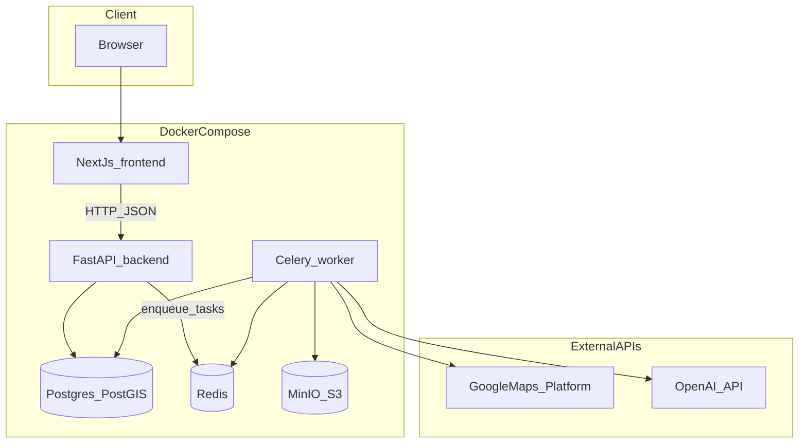
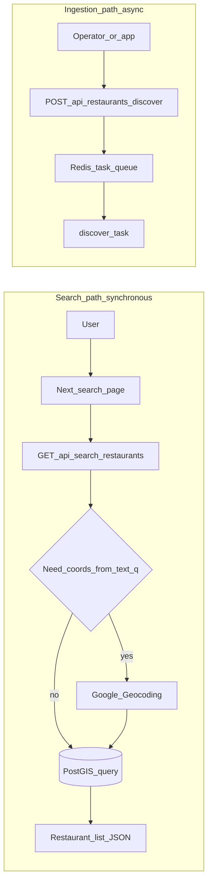
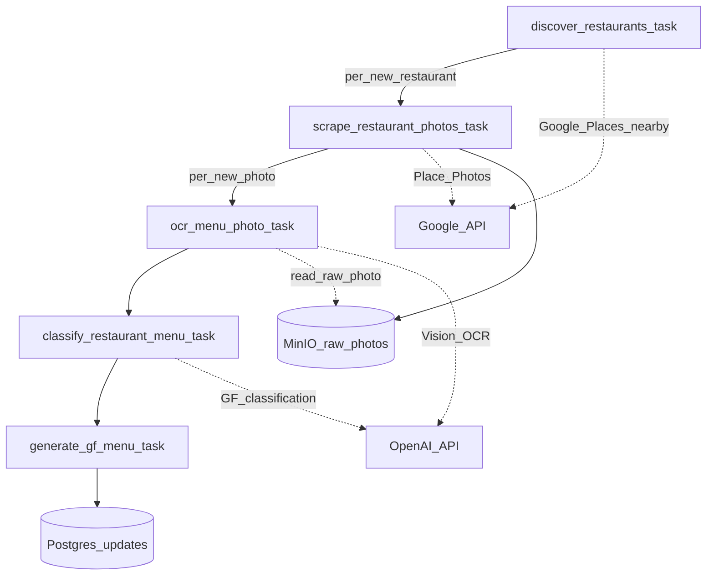

# GF Finder — Gluten-Free Menu Finder

AI-powered restaurant menu analysis for celiac and gluten-sensitive diners. The app discovers venues via **Google Places**, pulls menu imagery from **Google Place Photos**, runs **OpenAI** vision for OCR and gluten-aware classification, and exposes searchable gluten-free menus with safety-oriented signals.

**Yelp Fusion is not used** in the ingestion workers (the client module remains in the tree for optional future use; discovery and photo scraping rely on Google only).

---

## What this stack does

| Concern | How it is handled |
|--------|-------------------|
| **Where** | PostGIS stores restaurant locations; search supports radius, distance sort, and text geocoding. |
| **Discovery** | Celery task calls Google Places Nearby Search and upserts rows into PostgreSQL. |
| **Menu input** | Place photos are downloaded to S3-compatible **MinIO**, then OCR’d per image. |
| **GF logic** | Classifier + sensitivity profiles build structured menu items and generated GF views. |

---

## Architecture (services)

Runtime layout when you use Docker Compose: browser talks to Next.js; Next.js calls the FastAPI API; workers consume Redis and touch the same database, object store, and external APIs.



**Stack summary**

- **Frontend:** Next.js 15 (App Router, React 19, Tailwind CSS, Leaflet maps)
- **Backend:** FastAPI (async SQLAlchemy 2.0, Pydantic v2)
- **Database:** PostgreSQL 16 + PostGIS
- **Queue:** Celery + Redis (broker and result backend)
- **Object storage:** MinIO (S3-compatible buckets for raw and processed photos)
- **AI:** OpenAI (vision for OCR/extraction and downstream classification paths configured in code, e.g. `gpt-4o`)

---

## Request paths: search vs ingestion

Interactive search reads **only what is already in the database** (plus geocoding when the user passes a text query). Bulk discovery and menu processing are **asynchronous** and driven by Celery.



- **Search:** `GET /api/search/restaurants` with `latitude` / `longitude` (and optional filters), or a text `q` that is forward-geocoded before the spatial query.
- **Discovery:** `POST /api/restaurants/discover` enqueues work; the worker pipeline fills the DB and object store over time.

---

## Ingestion pipeline (Celery)

Each stage is implemented as a Celery task; successful steps enqueue the next. Discovery fans out one scrape job per **new** restaurant; scrape fans out one OCR job per **new** photo; OCR triggers classification for the restaurant; classification triggers GF menu generation.



---

## Quick start

### Prerequisites

- Docker and Docker Compose
- API keys: **Google Places** (also used for Geocoding in this project) and **OpenAI**. Copy [`backend/.env.example`](backend/.env.example) to `backend/.env` and fill values. Yelp variables are optional and not used by workers.

### Setup

```bash
cd gluten-free-finder
cp backend/.env.example backend/.env
# Edit backend/.env with your API keys
```

```bash
docker compose up --build
```

### URLs (local)

| Service | URL |
|--------|-----|
| Frontend | http://localhost:3000 |
| Backend API | http://localhost:8000 |
| OpenAPI docs | http://localhost:8000/docs |
| MinIO console | http://localhost:9001 (default credentials in Compose) |

### Database migrations

```bash
docker compose exec backend alembic upgrade head
```

### Trigger discovery (example)

```bash
curl -X POST "http://localhost:8000/api/restaurants/discover?latitude=40.7128&longitude=-74.0060&radius_m=5000"
```

---

## Project structure

```
gluten-free-finder/
├── docker-compose.yml
├── backend/
│   ├── app/
│   │   ├── main.py              # FastAPI application
│   │   ├── config.py            # Pydantic Settings
│   │   ├── database.py          # Async SQLAlchemy session
│   │   ├── models/              # ORM: Restaurant, Menu*, etc.
│   │   ├── schemas/             # Request/response models
│   │   ├── routers/             # HTTP routes
│   │   ├── services/            # Domain logic
│   │   │   └── gf_analysis/     # Classifier, profiles, menu generator
│   │   ├── integrations/        # google_places, geocoding, openai_vision; yelp unused by workers
│   │   └── workers/tasks/       # Celery tasks (discover → scrape → ocr → classify → generate)
│   ├── alembic/
│   └── tests/
└── frontend/
    └── src/
        ├── app/
        ├── components/
        ├── lib/                   # API client and shared types
        └── hooks/
```

---

## Key HTTP endpoints

| Method | Path | Description |
|--------|------|-------------|
| GET | `/api/search/restaurants` | Geo search with filters and sorting (`distance` or `gf_item_count`) |
| GET | `/api/restaurants/{id}` | Restaurant detail |
| GET | `/api/restaurants/map` | Map pins for a bounding box |
| POST | `/api/restaurants/discover` | Enqueue area discovery (Google Places) |
| GET | `/api/menus/{id}/photos` | Menu photos (presigned URLs where applicable) |
| GET | `/api/menus/{id}/items` | Menu items (`?gf_only=true` optional) |
| GET | `/api/menus/{id}/gf-menu` | Generated GF menu by sensitivity profile |
| GET | `/api/menus/{id}/safe-count` | Quick safe-item count |

---

## Billing and quotas (operational note)

Google Maps Platform and OpenAI bill per usage (Google often includes monthly account credit; check current pricing in Google Cloud and OpenAI consoles). Discovery, geocoding, photo downloads, and vision calls are the main cost drivers. Keeping discovery radius modest and avoiding repeated photo downloads reduces spend.
